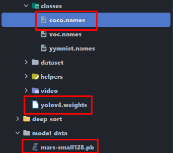
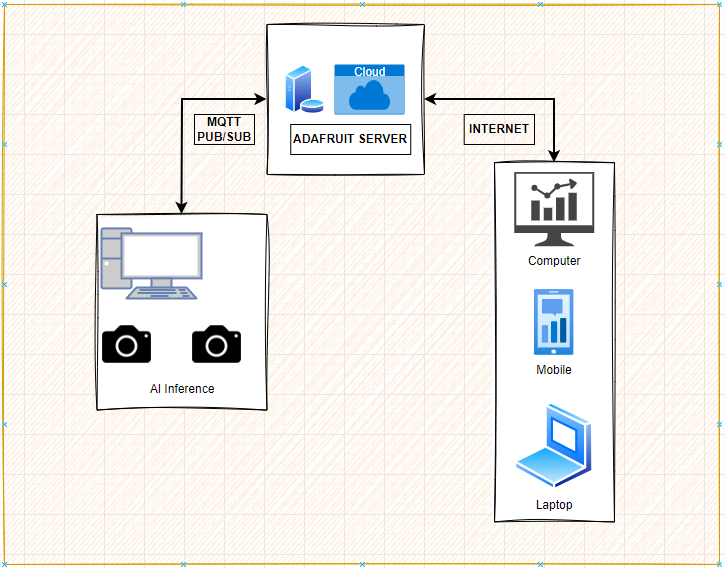
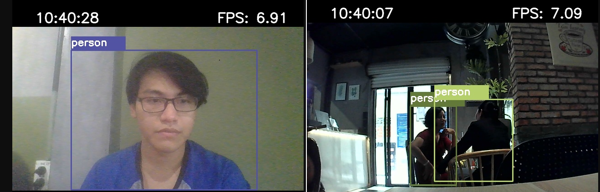
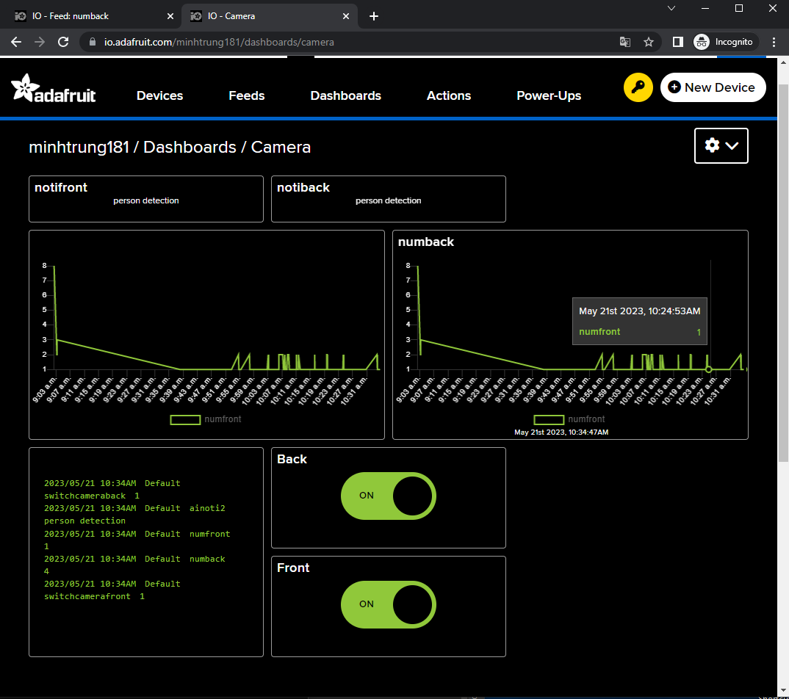
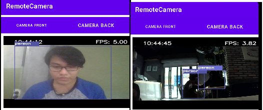
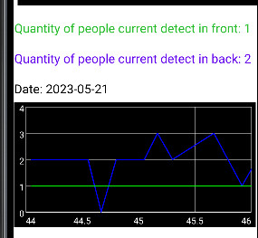

# yolov4-deepsort

Object tracking implemented with YOLOv4, DeepSort, and TensorFlow. YOLOv4 is a state of the art algorithm that uses deep convolutional neural networks to perform object detections. We can take the output of YOLOv4 feed these object detections into Deep SORT (Simple Online and Realtime Tracking with a Deep Association Metric) in order to create a highly accurate object tracker.

# Human Detection based on Object Detection

In this project, the goal of that is security cameras at home, which will supervise anything in video stream, in particularly human detection. We need to prepare somethings that are important for object detection. With files yolov4.weights that use to detect object in each image, mars-small128.pb is a model of deepsort that support for the process of tracking objects, and the finally file is coco.names that is dataset
of labels of classes object.This method read frame by frame and use each frame to detect object in there. At the same time, it also update information like the number of person that model detected in image.

   

# Basic Architecture

   

•Part 1: With main devices of this project is cameras that are connected with the processor like computer. Computer is like gateway that will communicate to cloud server.

• Part 2: A cloud server is here Adafruit-IO that will be a bridge to communicate between devices and other app.

• Part 3: A UI app from other devices like Android app will be interacted to Adafruit-IO.

# Implementation and demo
The following picture below display bounding box that draw arround human from 2 cameras with the named camfront and camback.

   
 

In addition, in Adafruit-IO dashboard, when cameras detected human, some information such as notification:"person detection" and the number of human that appear in an image also update in diagram. In this method, after every 5s data information will be published to server. When user click button, the payload of them also subcribe to gateway.

   
 

# Mobile App
First, we need to implement MQTT controller to Publish and Subcribe to Adafruit server. In Main Activity, we need to import class MQTTHelper and implement a function
call startMQTT() which create an instance of MQTTHelper an override method of this class with specific purpose. In Main Activity onCreate() function, we call startMQTT() to start things, code below show the work. Next, The application need frame to display source from camera, the application was implemented this frame in a fragment view, which can be switch by button. And GraphView to log people detected by AI:

   
 
# Conclusion and future plan
In general, my project has been built and implemented to system well. In this system, modules like human detection, tracking object, sending and receiving data in Adafruit-IO which I get executing is fine on the whole things. The results are
relatively positive. However, there are a few features as well as limitations of them that we would like to improve in the future:

• Improvement model accuracy: In this project, our model is available with a lot
of classes, it lead to some misunderstand detections if objects similarly with
other objects.

• Improvement the performace: As you can see that, when we run program
because of AI model, so it causes slow loading program, so that improving
speed of performance can be better for this project.
